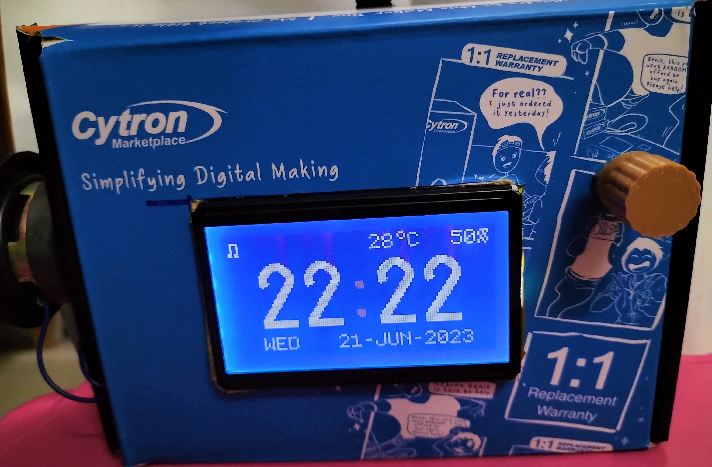

# Raspberry Pico Vintage Style Table Clock

## For the submission of Cytron's RPi Pico Maker Party 2023

Cytron's Maker Pi Pico is used with the Pico Debug Probe for the development of this code.

Requirements:
- [Cytron Maker Pico](https://my.cytron.io/p-maker-pi-pico?r=1)
- [Latest version of RP2040 SDK - 1.5.0 and above](https://github.com/raspberrypi/pico-sdk)

Video of the table clock in action:

Currently, the features are:
- The sound module is called [Simple FM synth](https://github.com/nyh-workshop/pico-fmSynth) and runs on Core 1. The clock chimes every hour from 6am to 9pm. Hourly chime can be selected as Westminster or a small excerpt of Pachelbel's Canon in D.
- PCM5102 and MAX98357 can be used for the sound module.
- The screen is a generic ST7920 and it is driven by the [U8G2](https://github.com/olikraus/u8g2) library and connected to the Pico using SPI. You can check the submodule [here](https://github.com/nyh-workshop/pico-u8g2-st7920).
- Rotary Encoder to set the time.
- RP2040's internal RTC module to keep and tell the time.
- Using DHT-11 module to get the temperature and humidity! Thanks to the library provided ([pico_dht](https://github.com/vmilea/pico_dht/tree/master)).
- DS3231 module is used to help keep time when the power is off. The contents of the DS3231 is synchronized with the local RTC on the Raspberry Pico.
- Added buzzer routines to sound it everytime a button pressed.

Limitations:
- Currently no way to stop melody when it is currently playing.
- No error messages when DHT-11 module gives wrong results, only not showing the results on the screen.
- Switching chime music might cause the next hour not to chime.
- Sometimes beeps sounded twice when button is pressed. Possibly need to work on how to limit it to one beep per press.

Schematic:

